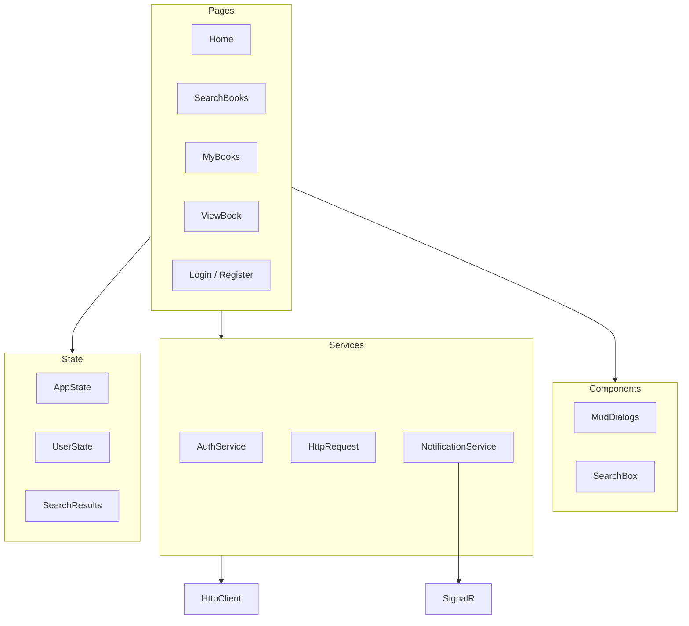

# LocalReads Blazor Frontend — Code Quality Analysis

> **Scope:** Blazor WebAssembly project at `LocalReads/` only. Backend (`LocalReads.API/`) is out of scope except where the frontend depends on it (API URLs, auth contracts).
>
> **Context:** This is a practice/learning project — the author's first time with Blazor WebAssembly (see `README.md`). This document is an honest review meant to guide incremental improvement, not a rewrite mandate.

---

## 1. Executive Summary

**Verdict:** This is a **solid first Blazor attempt**. The folder layout is clear, MudBlazor is used consistently, and you already have the right building blocks — a centralized HTTP layer, reusable dialogs, shared DTOs, and auth infrastructure. The gaps are **reliability and consistency issues** that are very common for first-time Blazor developers: lifecycle cleanup not wired up, authorization applied inconsistently, and HTTP responses used without success checks. None of these indicate a fundamental misunderstanding of Blazor; they are fixable with focused, small changes.

**Tech snapshot:**

| Item | Value |
|------|-------|
| Framework | .NET 8 Blazor WebAssembly |
| UI library | MudBlazor 8.6.0 |
| Storage | Blazored.LocalStorage 4.5.0 |
| Real-time | SignalR Client 9.0.7 |
| Pages | 9 routed pages |
| Components | 6 shared components |
| Layouts | 3 (Main, Login, NavMenu) |
| Tests | None |

**Dev URLs** (`LocalReads/Properties/launchSettings.json`): `http://localhost:5286`, `https://localhost:7146`

---

## 2. Architecture Overview



### Project structure

```
LocalReads/
├── App.razor                 # Root router + auth cascade
├── Program.cs                # DI bootstrap
├── _Imports.razor            # Global usings
├── Components/               # Reusable UI (dialogs, search, cards)
├── DTO/                      # Frontend-only DTOs (BookDto)
├── Layout/                   # MainLayout, LoginLayout, NavMenu
├── Models/                   # HttpResponse wrappers
├── Pages/                    # Routable pages
├── Services/                 # Auth, HTTP, notifications
├── State/                    # AppState, UserState, SearchResults
└── wwwroot/
    ├── index.html
    └── css/app.css
```

### Key files

| Role | File |
|------|------|
| Bootstrap / DI | `LocalReads/Program.cs` |
| Routing & auth shell | `LocalReads/App.razor` |
| HTTP layer | `LocalReads/Services/HttpRequest.cs` |
| Login/logout | `LocalReads/Services/AuthService.cs` |
| JWT claims | `LocalReads/Services/CustomAuthStateProvider.cs` |
| SignalR notifications | `LocalReads/Services/NotificationService.cs` |
| Session state container | `LocalReads/State/AppState.cs` |

### DI registration (`Program.cs`)

```csharp
// Scoped
HttpClient              → BaseAddress: http://localhost:5033 (hardcoded)
IAuthService            → AuthService
IHttpRequest            → HttpRequest
AppState
AuthenticationStateProvider → CustomAuthStateProvider

// Singleton
NotificationService

// Framework
Blazored.LocalStorage, MudServices (registered twice), AuthorizationCore
```

### Auth flow (simplified)

```
Login → AuthService → localStorage + AppState.UserState
                    → CustomAuthStateProvider.GetAuthenticationStateAsync()
HttpRequest → reads token from localStorage (via JS) → Bearer header
401 → clear localStorage → NavigateTo("/login")
MainLayout.OnInitialized → PersistLoggedInUser if User is null
```

### State pattern

Lightweight **manual state + C# events** — not Flux/Redux or cascading parameters.

| Class | Role |
|-------|------|
| `AppState` (scoped) | Container for `SearchResults` + `UserState` |
| `UserState` | Holds `AuthResponse`; `OnChange` event for UI refresh |
| `SearchResults` | Search term + book list; `OnTermSearchChange` / `OnBooksSearchChanged` events |

---

## 3. What You Did Well (Strengths)

These show good instincts for a first Blazor project:

| Area | Evidence |
|------|----------|
| **Clear project structure** | `Pages/`, `Components/`, `Services/`, `State/`, `Layout/` are well separated |
| **Centralized HTTP wrapper** | `HttpRequest` handles JWT attachment, 401 logout, and snackbar feedback |
| **Reusable MudBlazor dialogs** | `GenericDialog`, `AddToListDialog`, `RateBookDialog` reduce UI duplication |
| **Shared DTOs** | `LocalReads.Shared` project avoids duplicating API contracts |
| **Server-side table pagination** | `SearchBooks.razor` uses `MudTable` `ServerData` — correct for paged API data |
| **XSS-safe rendering** | No `MarkupString` usage; Razor `@` encoding throughout |
| **Auth infrastructure exists** | `CascadingAuthenticationState`, `AuthorizeRouteView`, `CustomAuthStateProvider` |
| **Explicit DTO mapping** | `BookDto.FromBook` / `ToBookDomain` in `DTO/BookDto.cs` |
| **Loading state on some pages** | `ViewBook.razor` and `LoginPage.razor` show loading indicators |

---

## 4. Issues Found (Honest, Severity-Ranked)

### High — fix first (bugs / reliability)

#### 1. Memory leaks from missing `@implements IDisposable`

You wrote `Dispose()` methods and unsubscribe from events — good instinct — but Blazor only calls `Dispose()` when the component declares `@implements IDisposable`.

**`SearchBooks.razor`** (lines 181–196): subscribes in `OnInitializedAsync`, defines `Dispose()`, but no interface declaration:

```181:196:LocalReads/Pages/SearchBooks.razor
    protected override async Task OnInitializedAsync()
    {
        AppState.SearchResults.OnTermSearchChange += StateHasChanged;
        AppState.SearchResults.OnBooksSearchChanged += TriggerReload;
        // ...
    }

    public void Dispose()
    {
        AppState.SearchResults.OnTermSearchChange -= StateHasChanged;
        AppState.SearchResults.OnBooksSearchChanged -= TriggerReload;
    }
```

**`NavMenu.razor`** (lines 56–70): same issue. Additionally, `NotificationService.OnNotificationReceived += StateHasChanged` (line 58) is **never unsubscribed**, even inside `Dispose()`.

**Impact:** Event handlers stay attached after navigation. Over time this causes unnecessary re-renders and potential null-reference errors on disposed components.

---

#### 2. `async void` anti-pattern

**`SearchBooks.razor`** line 300:

```300:310:LocalReads/Pages/SearchBooks.razor
    private async void TriggerReload()
    {
        await InvokeAsync(async () =>
        {
            if (_table != null)
            {
                await _table.ReloadServerData();
                StateHasChanged();
            }
        });
    }
```

`async void` is only appropriate for UI framework event handlers (e.g. `@onclick`). Custom event handlers should return `async Task`. Exceptions in `async void` methods are unobservable and can crash the WASM runtime silently.

**Fix:** Change to `private async Task TriggerReload()` and ensure the event subscription matches the delegate signature.

---

#### 3. Authorization is inconsistent

| Page | Protection |
|------|------------|
| `EditProfile.razor` | `[Authorize]` attribute (only page with it) |
| `Home.razor` | Manual `Navigation.NavigateTo("/login")` if not logged in |
| `MyBooks.razor`, `MyServer.razor`, `SearchBooks.razor`, `ViewBook.razor` | No guard at all |
| `LoginPage.razor`, `RegisterPage.razor` | Redirect to `/` if already logged in |

**Broken NotAuthorized links** in `App.razor` line 8:

```6:9:LocalReads/App.razor
                <NotAuthorized>
                    <h3>Oops! you are not allowed to see this page</h3>
                    <h5>Please <a href="/users/login">Login</a> or <a href="/users/register">register</a>  </h5>
                </NotAuthorized>
```

Actual routes are `/login` and `/register` — these links will 404.

**Impact:** Unauthenticated users can navigate directly to `/mybooks` and hit null-reference failures on `AppState.UserState.User.Id` (e.g. `SearchBooks.razor` line 220).

---

#### 4. Unchecked HTTP responses

`HttpRequest.Get<T>()` returns `HttpResponse<T>` with a `Success` flag, but most pages use `.Content` without checking:

**`Home.razor`** lines 89–90:

```89:90:LocalReads/Pages/Home.razor
        _favorites = (await HttpRequest.Get<List<Favorite>>($"/favorite/inprogress")).Content;
        _notifications = (await HttpRequest.Get<List<Notification>>("/notifications/week")).Content;
```

Same pattern in:
- `ViewProfile.razor` (~line 61)
- `MyBooks.razor` (~line 121)
- `ViewBook.razor` line 105

**Impact:** If the API fails or returns 401, `Content` may be `default`/`null` and the UI crashes with a null-reference exception. No error message is shown to the user.

---

#### 5. Hardcoded configuration

| Location | Hardcoded value |
|----------|-----------------|
| `Program.cs` line 15 | `http://localhost:5033` (API base URL) |
| `NotificationService.cs` lines 17–18 | `https://localhost:7223/notification-hub` |
| `NavMenu.razor` line 81 | `Navigation.NavigateTo("/profile/1")` — always user ID 1 |

**Impact:** App breaks outside local dev. Profile avatar always opens the wrong user's profile.

---

### Medium — maintainability / correctness

| Issue | Location | Details |
|-------|----------|---------|
| **Duplicate `AddMudServices()`** | `Program.cs` lines 20 and 26–37 | Registered twice; second call may override first config unpredictably |
| **Dual token storage access** | `AuthService.cs` (Blazored) vs `HttpRequest.cs` lines 213–221 (JS interop) | Same `userState` localStorage key read two different ways |
| **`NotifyAuthenticationStateChanged` on every auth read** | `CustomAuthStateProvider.cs` line 46 | Called inside `GetAuthenticationStateAsync` every time — causes unnecessary re-renders; should only notify on login/logout/token change |
| **Silent exception swallowing** | `SearchBooks.razor` lines 289–296 | `catch (Exception)` returns stale data with no user feedback |
| **Pagination guard logic likely wrong** | `SearchBooks.razor` lines 276–281 | Guard uses `_guardOldPageIndex != state.Page && !_guardOldSearch.Equals(...)` (AND) — likely should be OR; `_notShowPromptTwiceOnOverride` (line 179) is unused dead state |
| **ViewBook list type not initialized** | `ViewBook.razor` lines 98, 105–110 | `_listType` defaults to `WantToRead` and is never set from `ServerBook.Favorite.State` after load — select shows wrong value |
| **Register page incomplete UX** | `RegisterPage.razor` lines 27–31, 59–67 | `_isLoading` is never set to `true`; `_error` is never populated; button text says "Signing in..." on a register page |
| **EditProfile save feedback missing** | `EditProfile.razor` | `HandlUpdate` (typo) ignores failure; success branch is empty |
| **Duplicated favorite/progress logic** | `SearchBooks.razor`, `Home.razor`, `MyBooks.razor` | Same dialog + API + snackbar patterns copied across pages (~50+ lines each) |
| **MyBooks table reload misuse** | `MyBooks.razor` | Table is client-bound (`Items="@_favorites"`), but category change calls `ReloadServerData()` — meant for `ServerData` tables |
| **Dead / broken code** | `BookCard.razor` | Not referenced anywhere; all three menu items call the same handler; state hardcoded to `InProgress` |
| **Unused method** | `SearchBooks.razor` lines 312–315 | `GoToBook` is never called (links use `MudLink` directly) |
| **Logout link race** | `NavMenu.razor` lines 46–47 | `<a href="/" @onclick="LogOut">` may navigate before async logout finishes |
| **Missing static assets** | `wwwroot/` | Referenced but absent: `staticfiles/icon-logo.png`, `staticfiles/userprofile.png`, `images/placeholder-book.png` |
| **Home book links go to `/`** | `Home.razor` lines 20–24 | Book titles link to home, not `/viewbook/{id}` |
| **MyServer back button inert** | `MyServer.razor` line 8 | Back button has no `OnClick` handler |
| **Stub UI with no handlers** | `MyBooks.razor`, `ViewBook.razor` | "Add a comment", Edit/View buttons, "Edit My Activity" — placeholders only |
| **AuthService TODO** | `AuthService.cs` line 29 | Login errors not surfaced beyond bool return |

---

### Low — polish / conventions

| Issue | Details |
|-------|---------|
| **No `PageTitle` on pages** | Only `App.razor` NotFound has one — hurts browser tab titles and accessibility |
| **`FocusOnNavigate` targets `h1`** | `App.razor` line 11 — pages use `MudText Typo.h5/h4`, not `<h1>`, so focus management likely does nothing |
| **Inconsistent naming** | `HandlUpdate`, `AfirmativeText`, `isLoading` vs `_isLoading`, `State` vs `AppState` inject names |
| **SearchBox UX inconsistency** | `SearchBox.razor` uses raw HTML input/emoji button while rest of app uses MudBlazor; no Enter-key search, no `aria-label` |
| **No CSS isolation** | Mix of global `app.css`, per-page `<style>` blocks, and Mud utilities — no `.razor.css` files |
| **Package version skew** | WebAssembly 8.0.12, Authorization 8.0.16, SignalR.Client 9.0.7 — minor but worth aligning |
| **No frontend tests** | No bUnit, Playwright, or test project in solution |
| **Nullable reference gaps** | `SearchResults.cs`, `UserState.cs` — properties not initialized despite nullable enabled in csproj |
| **Minimal accessibility** | Icon-only actions rely on `MudTooltip` (not sufficient for screen readers); no `AriaLabel` on `MudIconButton` |

---

## 5. Blazor-Specific Learning Notes

Explanations for patterns you will encounter as you continue with Blazor.

### `@implements IDisposable`

When a component subscribes to events in `OnInitialized` or `OnInitializedAsync`, it **must**:

1. Unsubscribe in `Dispose()`
2. Declare `@implements IDisposable` at the top of the `.razor` file

Without step 2, Blazor never calls your `Dispose()` method. This is the most common lifecycle mistake for new Blazor developers.

```razor
@implements IDisposable

@code {
    protected override void OnInitialized()
    {
        AppState.UserState.OnChange += StateHasChanged;
    }

    public void Dispose()
    {
        AppState.UserState.OnChange -= StateHasChanged;
    }
}
```

### `async Task` vs `async void`

| Use | When |
|-----|------|
| `async Task` | Your own methods, event handlers you define |
| `async void` | Only Blazor/UI framework event bindings (e.g. `@onclick`) |

Custom methods like `TriggerReload` should return `Task`. Exceptions in `async void` are swallowed by the runtime.

### `[Authorize]` vs manual redirects

You already have `AuthorizeRouteView` in `App.razor` — it shows the `NotAuthorized` template automatically. The consistent approach:

1. Add `@attribute [Authorize]` to every page that requires login
2. Remove manual `Navigation.NavigateTo("/login")` checks (except on auth pages redirecting logged-in users away)
3. Fix the `NotAuthorized` links to point to `/login` and `/register`

### `StateHasChanged`

Blazor re-renders automatically after event handlers and lifecycle methods complete. You only need `StateHasChanged()` when updating state **outside** the normal render cycle — e.g. from a C# event, a `Timer`, or SignalR callback. Passing `StateHasChanged` directly as an event handler works but couples components to the render pipeline; a named handler is clearer.

### Scoped `AppState`

Registering `AppState` as **scoped** is correct for per-session state in Blazor WASM. Using C# events on it is a valid lightweight pattern. Just remember to unsubscribe in `Dispose()`.

### When to extract a service

Extract when the same **HTTP + dialog + snackbar** flow appears in 3+ places. Your favorites CRUD logic (add to list, update progress, rate, delete) is duplicated across `SearchBooks`, `Home`, and `MyBooks` — an `IFavoritesService` would be the single biggest maintainability win.

### Code-behind (`.razor.cs`)

Everything is inline `@code` today, which is fine for small components. When a page exceeds ~200 lines of logic (like `SearchBooks.razor` at 317 lines), consider moving the `@code` block to a partial class file (`SearchBooks.razor.cs`). This is a convention preference, not a requirement.

---

## 6. Prioritized Improvement Roadmap

Actionable phases for future implementation. Each phase builds on the previous one.

### Phase 1 — Quick wins (1–2 hours)

- [ ] Add `@implements IDisposable` to `SearchBooks.razor` and `NavMenu.razor`
- [ ] Unsubscribe `NotificationService.OnNotificationReceived` in `NavMenu.Dispose()`
- [ ] Change `TriggerReload` from `async void` to `async Task` in `SearchBooks.razor`
- [ ] Fix `App.razor` NotAuthorized links: `/users/login` → `/login`, `/users/register` → `/register`
- [ ] Remove duplicate `AddMudServices()` in `Program.cs` (keep the configured one at lines 26–37)
- [ ] Fix `NavMenu.razor` profile link: use `AppState.UserState.User.Id` instead of hardcoded `1`

### Phase 2 — Reliability (half day)

- [ ] Add `@attribute [Authorize]` to protected pages: `/`, `/mybooks`, `/myserver`, `/searchbooks`, `/profile/edit`
- [ ] Remove redundant manual login redirects on `Home.razor` once `[Authorize]` is in place
- [ ] Guard all HTTP calls: check `response.Success` before accessing `.Content`
- [ ] Add loading spinners and error messages to data pages (`Home`, `MyBooks`, `ViewProfile`, `MyServer`)
- [ ] Externalize API and SignalR URLs to `wwwroot/appsettings.json` + `builder.Configuration`
- [ ] Initialize `ViewBook._listType` from `ServerBook.Favorite.State` after API load
- [ ] Fix `RegisterPage.razor`: set `_isLoading`, populate `_error`, fix button text

### Phase 3 — Maintainability (1–2 days)

- [ ] Extract `IFavoritesService` / `FavoritesService` for add, update, delete, and rate flows
- [ ] Consolidate token access through `IAuthService` only — remove JS interop duplication in `HttpRequest`
- [ ] Move `NotifyAuthenticationStateChanged` out of `GetAuthenticationStateAsync` — call only on login/logout
- [ ] Remove or fix dead code: `BookCard.razor`, `GoToBook` in SearchBooks, stub buttons in MyBooks
- [ ] Fix `Home.razor` book title links to navigate to `/viewbook/{googleBookId}`
- [ ] Add missing `wwwroot` assets or update references to existing images

### Phase 4 — Quality (ongoing)

- [ ] Add bUnit tests for `GenericDialog`, `AddToListDialog`, and auth flow
- [ ] Accessibility pass: `PageTitle` per page, `<h1>` headings, `AriaLabel` on icon buttons
- [ ] Migrate per-page `<style>` blocks to CSS isolation (`.razor.css` files)
- [ ] Replace `SearchBox.razor` raw HTML with `MudTextField` + `@onkeydown` for Enter
- [ ] Align NuGet package versions (SignalR 8.x to match Components 8.x)
- [ ] Consider Playwright E2E tests for critical user flows (login → search → add to list)

---

## 7. File Inventory

### Pages (9 routed)

| File | Route | Purpose | Auth |
|------|-------|---------|------|
| `Pages/Home.razor` | `/` | Dashboard: in-progress favorites + weekly notifications | Manual redirect |
| `Pages/SearchBooks.razor` | `/searchbooks` | Google Books search results with pagination; add to lists | None |
| `Pages/MyBooks.razor` | `/mybooks` | User favorites by list type; rate, delete, update progress | None |
| `Pages/MyServer.razor` | `/myserver` | Community view: member list + popular books | None |
| `Pages/ViewBook.razor` | `/viewbook/{googleBookId}` | Book detail; change favorite state | None |
| `Pages/ViewProfile.razor` | `/profile/{id}` | Public user profile | None |
| `Pages/EditProfile.razor` | `/profile/edit` | Edit own profile | `[Authorize]` |
| `Pages/LoginPage.razor` | `/login` | Login form (`LoginLayout`) | Public |
| `Pages/RegisterPage.razor` | `/register` | Registration form (`LoginLayout`) | Public |

### Layouts (3)

| File | Purpose |
|------|---------|
| `Layout/MainLayout.razor` | MudLayout shell; restores session on init |
| `Layout/LoginLayout.razor` | Minimal layout for auth pages |
| `Layout/NavMenu.razor` | Top app bar: nav links, search, notifications, logout, avatar |

### Components (6, no `@page`)

| File | Purpose | Status |
|------|---------|--------|
| `Components/SearchBox.razor` | Nav search input; sets `AppState.SearchResults`, navigates to `/searchbooks` | Active |
| `Components/AddToListDialog.razor` | MudDialog: confirm add to list with progress/date | Active |
| `Components/AddToWishlistDialog.razor` | MudDialog: confirm wishlist add | Active |
| `Components/RateBookDialog.razor` | MudDialog: star rating slider | Active |
| `Components/GenericDialog.razor` | Reusable confirm/cancel dialog | Active |
| `Components/BookCard.razor` | Horizontal book card with "add to list" menu | **Dead code** — not referenced |

### Root & config

| File | Purpose |
|------|---------|
| `App.razor` | `CascadingAuthenticationState` + `AuthorizeRouteView` + `FocusOnNavigate` |
| `Program.cs` | WASM host builder, service registration |
| `_Imports.razor` | Global using directives |
| `wwwroot/index.html` | HTML shell, MudBlazor CSS/JS references |
| `wwwroot/css/app.css` | Global custom styles (~59 lines) |

### Services

| File | Role |
|------|------|
| `Services/AuthService.cs` | Login/logout; persists `AuthResponse` to localStorage |
| `Services/CustomAuthStateProvider.cs` | Reads JWT from localStorage, parses claims |
| `Services/HttpRequest.cs` | Central HTTP wrapper (GET/POST/PUT/PATCH/DELETE) |
| `Services/NotificationService.cs` | SignalR hub connection; queues notifications |
| `Services/IAuthService.cs` | Auth service interface |
| `Services/IHttpRequest.cs` | HTTP service interface |

### State

| File | Role |
|------|------|
| `State/AppState.cs` | Container for `SearchResults` + `UserState` |
| `State/UserState.cs` | Holds `AuthResponse`; `OnChange` event |
| `State/SearchResults.cs` | Search term + book list; change events |

### DTOs & models (frontend-only)

| File | Role |
|------|------|
| `DTO/BookDto.cs` | Maps Google Books API shape to/from domain `Book` |
| `Models/HttpResponse.cs` | Wrapper for HTTP results with `Success`, `Content`, `ErrorMessage` |

---

## 8. Conventions to Adopt Going Forward

Recommended patterns for this project specifically:

1. **Always `@attribute [Authorize]`** on pages that require login — do not mix with manual redirects.
2. **Always check `response.Success`** before using `response.Content` from `HttpRequest`.
3. **Always `@implements IDisposable`** when subscribing to events in `OnInitialized`.
4. **One `AddMudServices()` call** in `Program.cs` with your snackbar config.
5. **Prefer MudBlazor components** over raw HTML (`MudTextField` instead of `<input>`).
6. **Extract a service** when the same HTTP + dialog flow appears in 3+ pages.
7. **Use `async Task`** for all custom async methods — never `async void`.
8. **Externalize URLs** to `wwwroot/appsettings.json` — never hardcode localhost addresses.
9. **Add `PageTitle`** to every page for browser tabs and screen readers.
10. **Remove dead code promptly** — `BookCard.razor` and unused methods create confusion for future you.

---

## 9. Styling Approach (Current State)

| Layer | Used? | Files |
|-------|-------|-------|
| MudBlazor components & utilities | Yes | All pages |
| Global custom CSS | Yes | `wwwroot/css/app.css` |
| Per-page `<style>` blocks | Yes | `Home.razor`, `SearchBooks.razor`, `MyServer.razor` |
| CSS isolation (`.razor.css`) | No | — |
| SCSS / Tailwind | No | — |
| Inline `Style="..."` on Mud components | Yes | Common throughout |

As the app grows, migrate per-page `<style>` blocks to `.razor.css` files for better encapsulation.

---

## 10. Security Notes (Frontend Only)

| Topic | Status |
|-------|--------|
| XSS from displayed text | Safe — Razor `@` encoding, no `MarkupString` |
| JWT storage | `localStorage` — standard WASM tradeoff; vulnerable if XSS is ever introduced |
| Client-side auth guards | Incomplete — real enforcement must be on API (assumed) |
| Refresh tokens | Not implemented |
| External content | Book cover URLs and Unsplash backgrounds load third-party content |

---

*Last reviewed: June 2026. Re-run this analysis after major frontend changes.*
