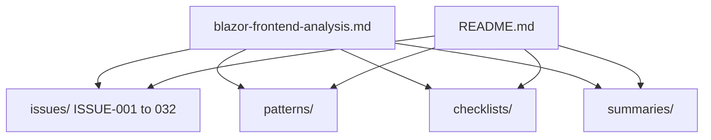

# LocalReads Blazor Frontend — Project Review

Structured code quality review of the **LocalReads** Blazor WebAssembly frontend (`LocalReads/`). This is analysis documentation only — no fixes have been applied.

**Source analysis:** [`.cursor/knowledge/blazor-frontend-analysis.md`](../.cursor/knowledge/blazor-frontend-analysis.md)

---

## How to Use This Review

| File | Purpose |
|------|---------|
| `issue.md` | Quick reference — ID, severity, status, affected files, summary |
| `analysis.md` | Root cause, code references, impact, how to verify |
| `fix.md` | Proposed solution (reference implementation, not applied) |
| `resolution.md` | **Next-step plan** for a future fix session — always `Status: Planned` |
| `screenshots/` | Empty placeholder — add browser screenshots when reproducing issues |

---

## Review Structure



---

## Summaries

| Document | Description |
|----------|-------------|
| [Executive Summary](summaries/executive-summary.md) | Verdict, tech snapshot, top 5 risks |
| [Technical Debt Report](summaries/technical-debt-report.md) | Debt by area, 4-phase roadmap, effort estimates |
| [Learning Journal](summaries/learning-journal.md) | First-time Blazor developer notes and study guide |

---

## Checklists

| Checklist | Use when |
|-----------|----------|
| [Code Review](checklists/code-review-checklist.md) | Reviewing any PR to `LocalReads/` |
| [Security](checklists/security-checklist.md) | Auth, token, XSS review |
| [Performance](checklists/performance-checklist.md) | Lifecycle, re-renders, table binding |
| [Architecture](checklists/architecture-checklist.md) | New services, structure, config |

---

## Patterns

| Category | Guides |
|----------|--------|
| [Security](patterns/security/) | Authorization, JWT, XSS, client guards |
| [Performance](patterns/performance/) | Lifecycle, re-renders, event subscriptions |
| [Clean Code](patterns/clean-code/) | Naming, dead code, duplication, async |
| [Architecture](patterns/architecture/) | Structure, state, services, MudBlazor |
| [Testing](patterns/testing/) | Current gap, bUnit, E2E strategy |

---

## Issue Registry

### High Severity (5)

| ID | Title | Status |
|----|-------|--------|
| [ISSUE-001](issues/ISSUE-001/issue.md) | Memory leaks from missing `@implements IDisposable` | Open |
| [ISSUE-002](issues/ISSUE-002/issue.md) | `async void` anti-pattern in `TriggerReload` | Open |
| [ISSUE-003](issues/ISSUE-003/issue.md) | Authorization is inconsistent | Open |
| [ISSUE-004](issues/ISSUE-004/issue.md) | Unchecked HTTP responses | Open |
| [ISSUE-005](issues/ISSUE-005/issue.md) | Hardcoded configuration | Open |

### Medium Severity (18)

| ID | Title | Status |
|----|-------|--------|
| [ISSUE-006](issues/ISSUE-006/issue.md) | Duplicate `AddMudServices()` registration | Open |
| [ISSUE-007](issues/ISSUE-007/issue.md) | Dual token storage access paths | Open |
| [ISSUE-008](issues/ISSUE-008/issue.md) | `NotifyAuthenticationStateChanged` on every auth read | Open |
| [ISSUE-009](issues/ISSUE-009/issue.md) | Silent exception swallowing in search table | Open |
| [ISSUE-010](issues/ISSUE-010/issue.md) | Pagination guard logic likely wrong | Open |
| [ISSUE-011](issues/ISSUE-011/issue.md) | ViewBook list type not initialized from server | Open |
| [ISSUE-012](issues/ISSUE-012/issue.md) | Register page incomplete UX | Open |
| [ISSUE-013](issues/ISSUE-013/issue.md) | EditProfile save feedback missing | Open |
| [ISSUE-014](issues/ISSUE-014/issue.md) | Duplicated favorite/progress logic across pages | Open |
| [ISSUE-015](issues/ISSUE-015/issue.md) | MyBooks table reload misuse | Open |
| [ISSUE-016](issues/ISSUE-016/issue.md) | Dead/broken `BookCard` component | Open |
| [ISSUE-017](issues/ISSUE-017/issue.md) | Unused `GoToBook` method in SearchBooks | Open |
| [ISSUE-018](issues/ISSUE-018/issue.md) | Logout link navigation race | Open |
| [ISSUE-019](issues/ISSUE-019/issue.md) | Missing static assets in wwwroot | Open |
| [ISSUE-020](issues/ISSUE-020/issue.md) | Home book links navigate to `/` instead of book detail | Open |
| [ISSUE-021](issues/ISSUE-021/issue.md) | MyServer back button inert | Open |
| [ISSUE-022](issues/ISSUE-022/issue.md) | Stub UI elements with no handlers | Open |
| [ISSUE-023](issues/ISSUE-023/issue.md) | AuthService login error handling incomplete | Open |

### Low Severity (9)

| ID | Title | Status |
|----|-------|--------|
| [ISSUE-024](issues/ISSUE-024/issue.md) | No `PageTitle` on pages | Open |
| [ISSUE-025](issues/ISSUE-025/issue.md) | `FocusOnNavigate` targets `h1` but pages use `MudText` | Open |
| [ISSUE-026](issues/ISSUE-026/issue.md) | Inconsistent naming conventions | Open |
| [ISSUE-027](issues/ISSUE-027/issue.md) | SearchBox UX inconsistency | Open |
| [ISSUE-028](issues/ISSUE-028/issue.md) | No CSS isolation | Open |
| [ISSUE-029](issues/ISSUE-029/issue.md) | Package version skew | Open |
| [ISSUE-030](issues/ISSUE-030/issue.md) | No frontend tests | Open |
| [ISSUE-031](issues/ISSUE-031/issue.md) | Nullable reference gaps in state classes | Open |
| [ISSUE-032](issues/ISSUE-032/issue.md) | Minimal accessibility support | Open |

---

## Recommended Fix Order

Start with [Phase 1 from the technical debt report](summaries/technical-debt-report.md):

1. ISSUE-001, ISSUE-002, ISSUE-003 (partial), ISSUE-005 (profile link), ISSUE-006
2. Then ISSUE-003 (full), ISSUE-004, ISSUE-005 (config), ISSUE-011, ISSUE-012
3. Then ISSUE-014, ISSUE-007, ISSUE-008, ISSUE-016, ISSUE-017, ISSUE-019–022
4. Finally ISSUE-024–032 (quality polish)

---

## Regenerating Issues

Issue folders can be regenerated from `generate_issues.py`:

```powershell
python project-review/generate_issues.py
```

---

*Review date: June 2026. Scope: `LocalReads/` Blazor WASM frontend only.*
